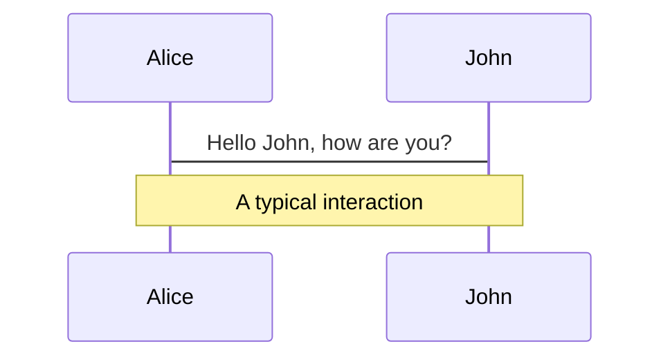
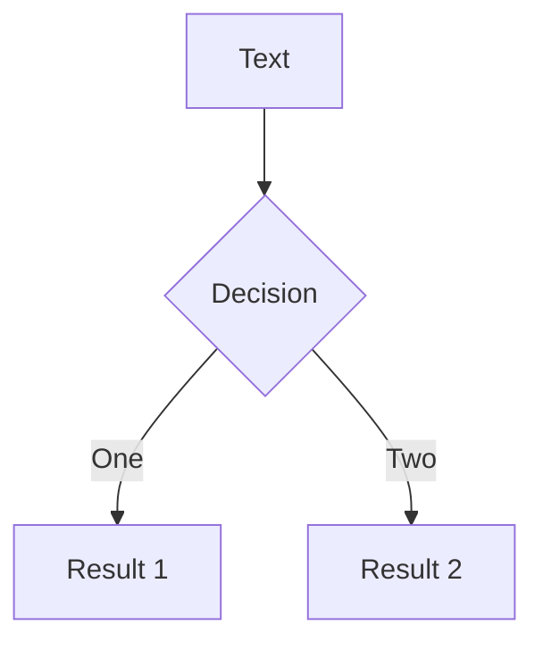
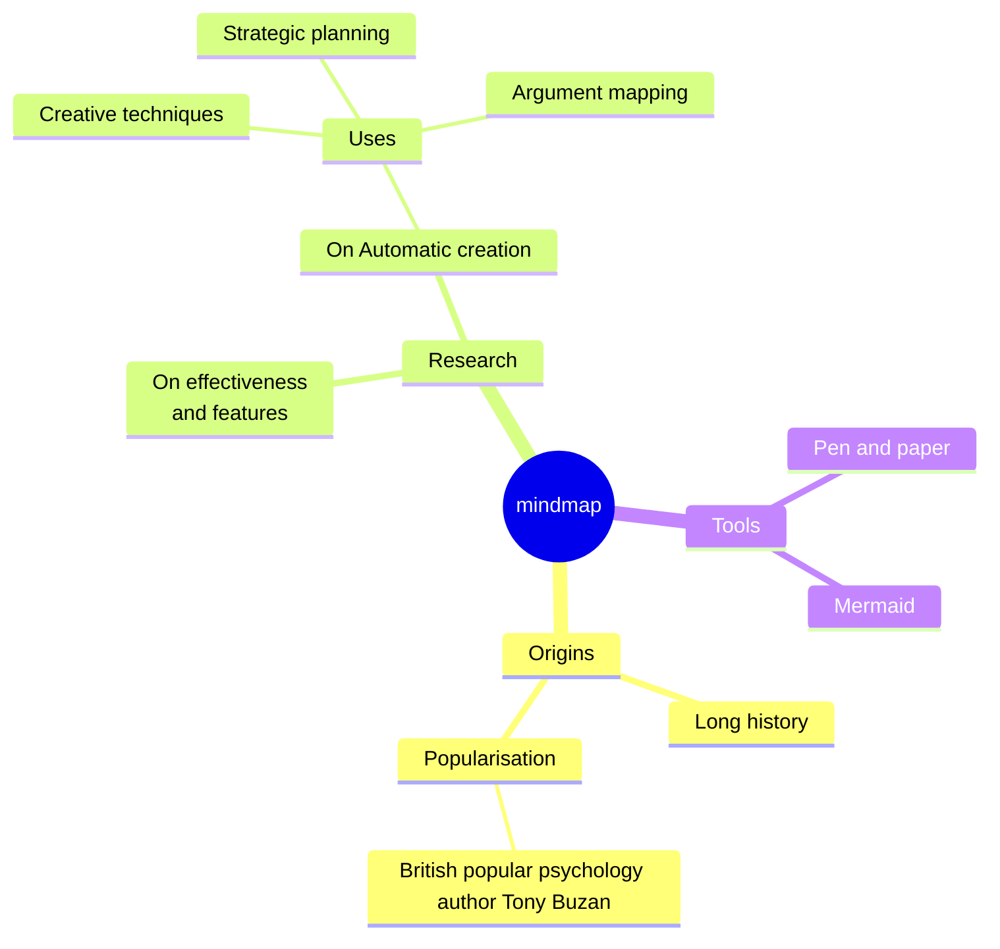
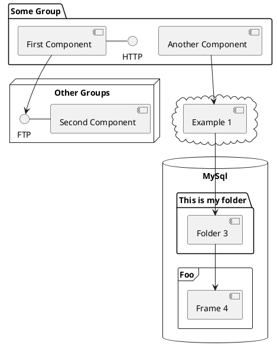

# Navigating Elixir's AST

## Credo and Sourceror's Building Blocks

---
layout: section
---

# What is an AST?

<div class="flex flex-col">
  <span v-click>Tree-Like Data Structure</span>
  <span v-click>Represents the code's syntatic structure</span>
  <span v-click>Each node can represent an operation, expression or statement</span>
</div>

<!--
- The representation abstracts away specific syntax details, like punctutation or formatting
- Provides a structure that makes it easier to analyze and manipulate code programmatically
- Helpful in compilting, interpreting and static code analysis
-->

---
layout: two-cols
layoutClass: gap-4
---

```elixir {all|1,5|1,5|2,4|2,4|2,4|3|3|all}{at:1}
defmodule Example do
  def add(x, y) do
    x + y
  end
end
```

::right::

````md magic-move {lines:false}
```elixir
@type ast :: node
@type node :: {atom, [node]}
```
```elixir
@type ast :: node
@type node :: {atom, [node]}

{:defmodule, []}
```
```elixir
@type ast :: node
@type node :: {atom, [node]}

{:defmodule, [
  {:Example, []}
]}
```
```elixir
@type ast :: node
@type node :: {atom, [node]}

{:defmodule, [
  {:Example, []},
  {:def, []}
]}
```
```elixir
@type ast :: node
@type node :: {atom, [node]}

{:defmodule, [
  {:Example, []},
  {:def, [
    {:add, []}
  ]}
]}
```
```elixir
@type ast :: node
@type node :: {atom, [node]}

{:defmodule, [
  {:Example, []},
  {:def, [
    {:add, [
      {:x, []}
      {:y, []}
    ]}
  ]}
]}
```
```elixir
@type ast :: node
@type node :: {atom, [node]}

{:defmodule, [
  {:Example, []},
  {:def, [
    {:add, [
      {:x, []}
      {:y, []}
    ]},
    {:+, []}
  ]}
]}
```
```elixir
@type ast :: node
@type node :: {atom, [node]}

{:defmodule, [
  {:Example, []},
  {:def, [
    {:add, [
      {:x, []}
      {:y, []}
    ]},
    {:+, [
      {:x, []},
      {:y, []}
    ]}
  ]}
]}
```
````

<!--
- Take this piece of Elixir code as an example
- Provides a structure that makes it easier to analyze and manipulate code programmatically
- Helpful in compilting, interpreting and static code analysis
-->

---
layout: section
---

# Elixir's AST

<div class="flex flex-col">
  <span class="flex gap-4 justify-center">
    <code v-click class="color-blue-600">Code</code>
    <code v-click class="color-blue-600">Macro</code>
  </span>
</div>

---
layout: default
---

# Elixir's AST

<div>
<p><code class="color-blue-600">Code</code></p>
<ul>
    <li v-click><code>Code.string_to_quoted/1</code> → String to AST</li>
    <li v-click><code>Code.eval_string/1</code> → Execute Elixir code</li>
    <li v-click><code>Code.eval_quoted/1</code> → Execute AST</li>
</ul>
<p v-click><code class="color-blue-600">Macro</code></p>
<ul>
    <li v-click><code>Macro.to_string/1</code> → AST to String</li>
    <li v-click><code>Macro.prewalk/2</code> → Traverse AST</li>
</ul>
</div>

<!--
- Elixir's standard library provides multiple functions in both the `Macro` and
`Code` modules that make it easier to work with Elixir's AST.
-->

---
layout: two-cols-header
layoutClass: gap-4
---

# `Code.string_to_quoted/1`

::left::

```elixir {all|2,6|3,5|4}{at:1}
Code.string_to_quoted!("""
defmodule Example do
  def add(x, y) do
    x + y
  end
end
""")
```

::right::

```elixir {all|1-4,20-22|5-12,18-19|13-16}{at:1}
{:defmodule, [line: 1],
  [
    {:__aliases__, [line: 1], [:Example]},
    [ do:
      {:def, [line: 2], [
        {
          :add, [line: 2], [
            {:x, [line: 2], nil},
            {:y, [line: 2], nil}
          ]
        },
        [ do:
            {:+, [line: 3], [
              {:x, [line: 3], nil},
              {:y, [line: 3], nil}
            ]
          }
        ]
      ]}
    ]
  ]
}
```

<!--
- Circling back to our example from before
- You can see how Elixir's actual AST structure looks a little bit different
- Each tuple has three elements, with the middle one being metadata for the node
- When there's no more children, `nil` is used instead, and `do` blocks are
defined as keyword lists
-->

---
layout: section
---

# AST Traversal

<div class="flex flex-col">
  <span v-click>Inspect Nodes</span>
  <span v-click>Collect Information</span>
  <span v-click>Apply Transformations</span>
</div>

---
layout: default
---

# AST Traversal - Unsafe String To Atom

<ul>
    <li v-click>Leverage <code>Macro.prewalk/2</code> to traverse the AST</li>
    <li v-click>Find calls to <code>String.to_atom/1</code></li>
    <li v-click>Prints message when calls are found</li>
</ul>

---
layout: default
---

# `Macro.prewalk/2`

```elixir
@doc """
Performs a depth-first, pre-order traversal of quoted expressions.

Returns a new AST where each node is the result of invoking `fun` on each
corresponding node of `ast`.
"""
@spec prewalk(t, (t -> t)) :: t
```

<v-click>

````md magic-move
```elixir
fn node -> IO.inspect(node) end
```

```elixir
Macro.prewalk(ast, fn node -> IO.inspect(node) end)
```

```elixir
Macro.prewalk(Code.string_to_quoted!(ast), fn node -> IO.inspect(node) end)
```

```elixir
"""
x + y
"""
|> Code.string_to_quoted!()
|> Macro.prewalk(fn node -> IO.inspect(node) end)
```

```elixir
"""
x + y
"""
|> Code.string_to_quoted!()
|> Macro.prewalk(fn node -> IO.inspect(node) end)

# `IO.inspect/1` calls
{:+, [line: 1], [{:x, [line: 1], nil}, {:y, [line: 1], nil}]}
{:x, [line: 1], nil}
{:y, [line: 1], nil}
```

```elixir
"""
x + y
"""
|> Code.string_to_quoted!()
|> Macro.prewalk(fn node -> IO.inspect(node) end)

# `IO.inspect/1` calls
{:+, [line: 1], [{:x, [line: 1], nil}, {:y, [line: 1], nil}]}
{:x, [line: 1], nil}
{:y, [line: 1], nil}

# Output
{:+, [line: 1], [{:x, [line: 1], nil}, {:y, [line: 1], nil}]}
```
````

</v-click>

---
layout: two-cols-header
layoutClass: gap-4
---

# AST Traversal - Unsafe String To Atom

::left::

````md magic-move {at:2}
```elixir
Code.string_to_quoted!("""
String.to_atom("ok")
""")
```
```elixir
fn node -> node end
```
```elixir
fn
  {:., _, _} = node ->
    node

  node ->
     node
end
```
```elixir
fn
  {:., _, [
    {:__aliases__, _, [:String]},
    :to_atom
  ]} = node ->
    IO.puts("Call Detected: String.to_atom/1 .")
    node

  node ->
    node
end
```
```elixir
checker = fn
  {:., _, [
    {:__aliases__, _, [:String]},
    :to_atom
  ]} = node ->
    IO.puts("Call Detected: String.to_atom/1 .")
    node

  node ->
    node
end

"""
String.to_atom("randomstring")
"""
|> Code.string_to_quoted!()
|> Macro.prewalk(checker)
```
````

::right::

```elixir {all|2-9}{at:1}
{
  {
    :.,
    [line: 1],
    [
      {:__aliases__, [line: 1], [:String]},
      :to_atom
    ]
  },
  [line: 1],
  ["ok"]
}
```

<!--
- Let's see the AST for a call to `String.to_atom/1`
- Knowing the "shape" of the node allows us to pattern-match against it
- With this information in mind, we can leverage `IO.puts/1` to print a message
when a call to `String.to_atom/1` is detected.
-->

---
layout: section
---

# Credo

A static code analysis tool for the Elixir language with a focus on code consistency and teaching.

---
layout: default
---

# Credo - Defining Custom Check

````md magic-move
```elixir
defmodule Credo.Check do
  @moduledoc """
  `Check` modules represent the checks which are run during Credo's analysis.
  """

  @callback run(source_file :: Credo.SourceFile.t(), params :: Keyword.t()) :: list(Credo.Issue.t())
end
```
```elixir {1-7}
defmodule Credo.SourceFile do
  @moduledoc """
  `SourceFile` structs represent a source file in the codebase.
  """

  @type t :: %__MODULE__{filename: nil | String.t(), hash: String.t(), status: :valid | :invalid | :timed_out}
end

defmodule Credo.Check do
  @callback run(source_file :: Credo.SourceFile.t(), params :: Keyword.t()) :: list(Credo.Issue.t())
end
```
```elixir {1-11}
defmodule Credo.Issue do
  @moduledoc """
  `Issue` structs represent all issues found during the code analysis.
  """

  defstruct message: nil,
            check: nil,
            filename: nil,
            line_no: nil,
            ...
end

defmodule Credo.SourceFile do
  @type t :: %__MODULE__{filename: nil | String.t(), hash: String.t(), status: :valid | :invalid | :timed_out}
end

defmodule Credo.Check do
  @callback run(source_file :: Credo.SourceFile.t(), params :: Keyword.t()) :: list(Credo.Issue.t())
end
```
```elixir
defmodule Credo.Issue do
  @moduledoc """
  `Issue` structs represent all issues found during the code analysis.
  """

  defstruct message: nil,
            check: nil,
            filename: nil,
            line_no: nil,
            ...
end

defmodule Credo.SourceFile do
  @type t :: %__MODULE__{filename: nil | String.t(), hash: String.t(), status: :valid | :invalid | :timed_out}
end

defmodule Credo.Check do
  @callback run(source_file :: Credo.SourceFile.t(), params :: Keyword.t()) :: list(Credo.Issue.t())
end
```
````

<!--
- Writing a custom check involves using `Credo.Check` and implementing the
`run/2` function
- The `run/2` function receives a `Credo.SourceFile` and is expected to return a
list of `Credo.Issue` structs
-->

---
layout: default
---

# Credo - Unsafe String To Atom

````md magic-move
```elixir
defmodule Credo.Check do
  @moduledoc """
  `Check` modules represent the checks which are run during Credo's analysis.
  """

  @callback run(
    source_file :: Credo.SourceFile.t(),
    params :: Keyword.t()
  ) :: list(Credo.Issue.t())
end
```
```elixir
defmodule Credo.Check.Warning.UnsafeToAtom do
  use Credo.Check
end
```
```elixir
defmodule Credo.Check.Warning.UnsafeToAtom do
  use Credo.Check

  @impl true
  def run(%SourceFile{} = source_file, params) do
    issue_meta = IssueMeta.for(source_file, params)
    Credo.Code.prewalk(source_file, &traverse(&1, &2, issue_meta))
  end
end
```
```elixir
defmodule Credo.Check.Warning.UnsafeToAtom do
  use Credo.Check

  @impl true
  def run(%SourceFile{} = source_file, params) do
    issue_meta = IssueMeta.for(source_file, params)
    Credo.Code.prewalk(source_file, &traverse(&1, &2, issue_meta))
  end

  defp traverse({{:., _loc, call}, meta, args} = ast, issues, issue_meta) do
    case get_forbidden_call(call, args) do
      {bad, suggestion, trigger} ->
        {ast, issues_for_call(bad, suggestion, trigger, meta, issue_meta, issues)}

      nil ->
        {ast, issues}
    end
  end
end
```
```elixir
defmodule Credo.Check.Warning.UnsafeToAtom do
  use Credo.Check, ...

  @impl true
  def run(%SourceFile{} = source_file, params) do
    issue_meta = IssueMeta.for(source_file, params)
    Credo.Code.prewalk(source_file, &traverse(&1, &2, issue_meta))
  end

  defp traverse({{:., _loc, call}, meta, args} = ast, issues, issue_meta) do
    case get_forbidden_call(call, args) do
      {bad, suggestion, trigger} ->
        {ast, issues_for_call(bad, suggestion, trigger, meta, issue_meta, issues)}

      nil ->
        {ast, issues}
    end
  end

  defp get_forbidden_call([{:__aliases__, _, [:String]}, :to_atom], [_]) do
    {"String.to_atom/1", "String.to_existing_atom/1", "String.to_atom"}
  end
end
```
```elixir
defmodule Credo.Check.Warning.UnsafeToAtom do
  use Credo.Check, ...

  @impl true
  def run(%SourceFile{} = source_file, params) do
    issue_meta = IssueMeta.for(source_file, params)
    Credo.Code.prewalk(source_file, &traverse(&1, &2, issue_meta))
  end

  defp traverse({{:., _loc, call}, meta, args} = ast, issues, issue_meta) do
    case get_forbidden_call(call, args) do
      {bad, suggestion, trigger} ->
        {ast, issues_for_call(bad, suggestion, trigger, meta, issue_meta, issues)}

      nil ->
        {ast, issues}
    end
  end

  defp get_forbidden_call([{:__aliases__, _, [:String]}, :to_atom], [_]), do: ...
  defp get_forbidden_call([{:__aliases__, _, [:List]}, :to_atom], [_]), do: ...
  defp get_forbidden_call([:erlang, :binary_to_atom], [_, _]), do: ...
end
```
````

<!--
- A lot of the source code has been removed for clarity, seeing as this serves
only as an example to compare how Credo also leverages Elixir's AST to provide
its functionalities
- The `Credo.Code.prewalk/2` function can be used to traverse the AST of a
`Credo.SourceFile`. It's a light wrapper around `Code.prewalk/2`, but it first
handles converting the `Credo.SourceFile` struct to an AST.
- The `issues_for_call` function simply adds another `Credo.Issue` function to
the list of issues reported by this check, by leveraging `format_issue/3` with
the provided information, which builds a `Credo.Issue` struct.
-->

---
layout: two-cols
layoutClass: gap-16
---

# Table of contents

You can use the `Toc` component to generate a table of contents for your slides:

```html
<Toc minDepth="1" maxDepth="1" />
```

The title will be inferred from your slide content, or you can override it with `title` and `level` in your frontmatter.

::right::

<Toc text-sm minDepth="1" maxDepth="2" />

---
layout: image-right
image: https://cover.sli.dev
---

# Code

Use code snippets and get the highlighting directly, and even types hover!

```ts [filename-example.ts] {all|4|6|6-7|9|all} twoslash
// TwoSlash enables TypeScript hover information
// and errors in markdown code blocks
// More at https://shiki.style/packages/twoslash
import { computed, ref } from 'vue'

const count = ref(0)
const doubled = computed(() => count.value * 2)

doubled.value = 2
```

<arrow v-click="[4, 5]" x1="350" y1="310" x2="195" y2="342" color="#953" width="2" arrowSize="1" />

<!-- This allow you to embed external code blocks -->
<<< @/snippets/external.ts#snippet

<!-- Footer -->

[Learn more](https://sli.dev/features/line-highlighting)

<!-- Inline style -->
<style>
.footnotes-sep {
  @apply mt-5 opacity-10;
}
.footnotes {
  @apply text-sm opacity-75;
}
.footnote-backref {
  display: none;
}
</style>

<!--
Notes can also sync with clicks

[click] This will be highlighted after the first click

[click] Highlighted with `count = ref(0)`

[click:3] Last click (skip two clicks)
-->

---
level: 2
---

# Shiki Magic Move

Powered by [shiki-magic-move](https://shiki-magic-move.netlify.app/), Slidev supports animations across multiple code snippets.

Add multiple code blocks and wrap them with <code>````md magic-move</code> (four backticks) to enable the magic move. For example:

````md magic-move {lines: true}
```ts {*|2|*}
// step 1
const author = reactive({
  name: 'John Doe',
  books: [
    'Vue 2 - Advanced Guide',
    'Vue 3 - Basic Guide',
    'Vue 4 - The Mystery'
  ]
})
```

```ts {*|1-2|3-4|3-4,8}
// step 2
export default {
  data() {
    return {
      author: {
        name: 'John Doe',
        books: [
          'Vue 2 - Advanced Guide',
          'Vue 3 - Basic Guide',
          'Vue 4 - The Mystery'
        ]
      }
    }
  }
}
```

```ts
// step 3
export default {
  data: () => ({
    author: {
      name: 'John Doe',
      books: [
        'Vue 2 - Advanced Guide',
        'Vue 3 - Basic Guide',
        'Vue 4 - The Mystery'
      ]
    }
  })
}
```

Non-code blocks are ignored.

```vue
<!-- step 4 -->
<script setup>
const author = {
  name: 'John Doe',
  books: [
    'Vue 2 - Advanced Guide',
    'Vue 3 - Basic Guide',
    'Vue 4 - The Mystery'
  ]
}
</script>
```
````

---

# Components

<div grid="~ cols-2 gap-4">
<div>

You can use Vue components directly inside your slides.

We have provided a few built-in components like `<Tweet/>` and `<Youtube/>` that you can use directly. And adding your custom components is also super easy.

```html
<Counter :count="10" />
```

<!-- ./components/Counter.vue -->
<Counter :count="10" m="t-4" />

Check out [the guides](https://sli.dev/builtin/components.html) for more.

</div>
<div>

```html
<Tweet id="1390115482657726468" />
```

<Tweet id="1390115482657726468" scale="0.65" />

</div>
</div>

<!--
Presenter note with **bold**, *italic*, and ~~striked~~ text.

Also, HTML elements are valid:
<div class="flex w-full">
  <span style="flex-grow: 1;">Left content</span>
  <span>Right content</span>
</div>
-->

---
class: px-20
---

# Themes

Slidev comes with powerful theming support. Themes can provide styles, layouts, components, or even configurations for tools. Switching between themes by just **one edit** in your frontmatter:

<div grid="~ cols-2 gap-2" m="t-2">

```yaml
---
theme: default
---
```

```yaml
---
theme: seriph
---
```


</div>

Read more about [How to use a theme](https://sli.dev/guide/theme-addon#use-theme) and
check out the [Awesome Themes Gallery](https://sli.dev/resources/theme-gallery).

---

# Clicks Animations

You can add `v-click` to elements to add a click animation.

<div v-click>

This shows up when you click the slide:

```html
<div v-click>This shows up when you click the slide.</div>
```

</div>

<br>

<v-click>

The <span v-mark.red="3"><code>v-mark</code> directive</span>
also allows you to add
<span v-mark.circle.orange="4">inline marks</span>
, powered by [Rough Notation](https://roughnotation.com/):

```html
<span v-mark.underline.orange>inline markers</span>
```

</v-click>

<div mt-20 v-click>

[Learn more](https://sli.dev/guide/animations#click-animation)

</div>

---

# Motions

Motion animations are powered by [@vueuse/motion](https://motion.vueuse.org/), triggered by `v-motion` directive.

```html
<div
  v-motion
  :initial="{ x: -80 }"
  :enter="{ x: 0 }"
  :click-3="{ x: 80 }"
  :leave="{ x: 1000 }"
>
  Slidev
</div>
```

<div class="w-60 relative">
  <div class="relative w-40 h-40">
    
    
    
  </div>

  <div
    class="text-5xl absolute top-14 left-40 text-[#2B90B6] -z-1"
    v-motion
    :initial="{ x: -80, opacity: 0}"
    :enter="{ x: 0, opacity: 1, transition: { delay: 2000, duration: 1000 } }">
    Slidev
  </div>
</div>

<!-- vue script setup scripts can be directly used in markdown, and will only affects current page -->
<script setup lang="ts">
const final = {
  x: 0,
  y: 0,
  rotate: 0,
  scale: 1,
  transition: {
    type: 'spring',
    damping: 10,
    stiffness: 20,
    mass: 2
  }
}
</script>

<div
  v-motion
  :initial="{ x:35, y: 30, opacity: 0}"
  :enter="{ y: 0, opacity: 1, transition: { delay: 3500 } }">

[Learn more](https://sli.dev/guide/animations.html#motion)

</div>

---

# LaTeX

LaTeX is supported out-of-box. Powered by [KaTeX](https://katex.org/).

<div h-3 />

Inline $\sqrt{3x-1}+(1+x)^2$

Block
$$ {1|3|all}
\begin{aligned}
\nabla \cdot \vec{E} &= \frac{\rho}{\varepsilon_0} \\
\nabla \cdot \vec{B} &= 0 \\
\nabla \times \vec{E} &= -\frac{\partial\vec{B}}{\partial t} \\
\nabla \times \vec{B} &= \mu_0\vec{J} + \mu_0\varepsilon_0\frac{\partial\vec{E}}{\partial t}
\end{aligned}
$$

[Learn more](https://sli.dev/features/latex)

---

# Diagrams

You can create diagrams / graphs from textual descriptions, directly in your Markdown.

<div class="grid grid-cols-4 gap-5 pt-4 -mb-6">









</div>

Learn more: [Mermaid Diagrams](https://sli.dev/features/mermaid) and [PlantUML Diagrams](https://sli.dev/features/plantuml)

---
foo: bar
dragPos:
  square: 0,-6,0,0
---

# Draggable Elements

Double-click on the draggable elements to edit their positions.

<br>

###### Directive Usage

```md

```

<br>

###### Component Usage

```md
<v-drag text-3xl>
  <div class="i-carbon:arrow-up" />
  Use the `v-drag` component to have a draggable container!
</v-drag>
```

<v-drag pos="376,282,261,_,-15">
  <div text-center text-3xl border border-main rounded>
    Double-click me!
  </div>
</v-drag>


###### Draggable Arrow

```md
<v-drag-arrow two-way />
```

<v-drag-arrow pos="138,335,332,-230" two-way op70 />

---
src: ./pages/imported-slides.md
hide: false
---

---

# Monaco Editor

Slidev provides built-in Monaco Editor support.

Add `{monaco}` to the code block to turn it into an editor:

```ts {monaco}
import { ref } from 'vue'
import { emptyArray } from './external'

const arr = ref(emptyArray(10))
```

Use `{monaco-run}` to create an editor that can execute the code directly in the slide:

```ts {monaco-run}
import { version } from 'vue'
import { emptyArray, sayHello } from './external'

sayHello()
console.log(`vue ${version}`)
console.log(emptyArray<number>(10).reduce(fib => [...fib, fib.at(-1)! + fib.at(-2)!], [1, 1]))
```

---
layout: center
class: text-center
---

# Learn More

[Documentation](https://sli.dev) · [GitHub](https://github.com/slidevjs/slidev) · [Showcases](https://sli.dev/resources/showcases)

<PoweredBySlidev mt-10 />
